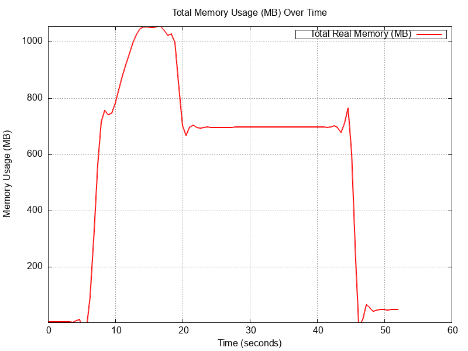
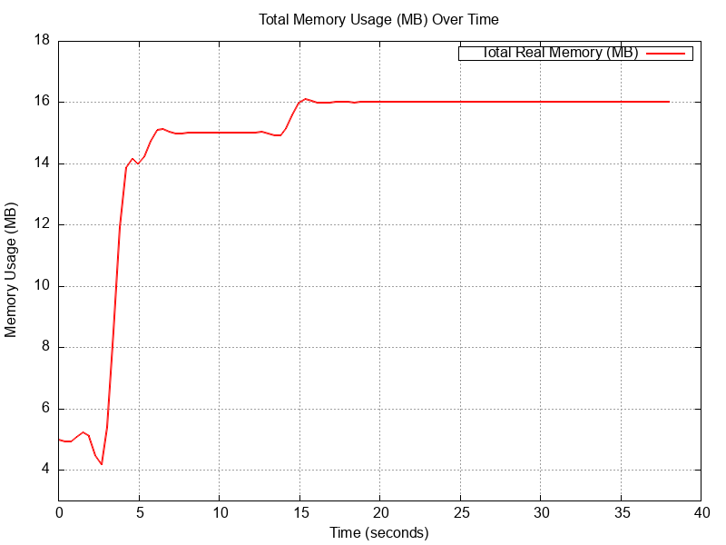

# Benchmark: Optimized JSON Streaming vs. Full JSON Loading

This document presents a **memory usage** and **performance** benchmark comparing two approaches to handling large JSON payloads in the [`HandleUpsert`](http/handlers/v1/harbors/harbors.go) endpoint:

1. **Optimized JSON Streaming** – Parses JSON **incrementally** without loading it entirely into memory.
2. **Full JSON Loading** – Reads the entire JSON request into memory before processing.

I'm using [`gnuplot`](http://www.gnuplot.info/) for plotting the graphs.

## Optimized JSON Streaming Strategy

The **optimized approach** reads harbors **one by one**, processing them **without fully loading the JSON** into memory:

```go
// HandleUpsert handles the upsert of harbors in a streaming fashion.
func (h *handlers) HandleUpsert(w http.ResponseWriter, r *http.Request) {
    ctr := newHttpResponseController(w)
    bufReader := bufio.NewReaderSize(r.Body, maxBufferedReaderSize)
    dec := json.NewDecoder(bufReader)

    // Check for opening '{'
    if err := h.readExpectedToken(dec, json.Delim('{')); err != nil {
        web.RespondWithError(w, http.StatusBadRequest, "invalid JSON: expected '{' at start")
        return
    }

    // Process harbors one by one
    if herr := h.processHarbors(r.Context(), dec); herr != nil {
        web.RespondWithError(w, herr.code, herr.Error())
        return
    }

    // Check for closing '}'
    if err := h.readExpectedToken(dec, json.Delim('}')); err != nil {
        web.RespondWithError(w, http.StatusBadRequest, "invalid JSON: expected '}' at end")
        return
    }

    // Flush response and finalize
    if err := ctr.Flush(); err != nil {
        web.RespondWithError(w, http.StatusInternalServerError, err.Error())
        return
    }
    web.RespondAfterFlush(w, UpsertHarborResponse{Message: "harbors upserted"})
}
```

### Advantages:
- Memory **stays low**, as only **one harbor** is loaded at a time.
- No large allocations reduce **GC pressure**.
- Processing starts **immediately**, reducing latency.

---

## Full JSON Loading Strategy

The **naive approach loads the entire JSON** into memory before processing:

```go
// HandleUpsert handles the upsert of harbors.
func (h *handlers) HandleUpsert(w http.ResponseWriter, r *http.Request) {
    ctr := newHttpResponseController(w)
    bufReader := bufio.NewReaderSize(r.Body, maxBufferedReaderSize)
    decoder := newJsonDecoder(bufReader)

    var rawMap map[string]json.RawMessage
    if err := decoder.Decode(&rawMap); err != nil {
        web.RespondWithError(w, http.StatusBadRequest, errors.Wrap(err, "decoding json").Error())
        return
    }

    if err := h.processHarbors(w, r, rawMap); err != nil {
        return
    }

    if err := ctr.Flush(); err != nil {
        web.RespondWithError(w, http.StatusInternalServerError, err.Error())
        return
    }
    web.RespondAfterFlush(w, UpsertHarborResponse{Message: "harbors upserted"})
    // trigger garbage collection manually. 
	runtime.GC()
	// request the operating system to release any memory that Go's runtime has
	// allocated but is no longer using.
	debug.FreeOSMemory()
}
```

### Disadvantages:
- **Memory spikes** due to loading **all** harbors at once.
- Can cause **out-of-memory (OOM) crashes** on large inputs.
- **Slower processing** as nothing starts until **all JSON is read**.

---

# Benchmarking Steps

### 1️ Generate Large JSON Data
First, generate **1 million harbors**:

```sh
$ ./json_gen.sh 1000000 big_ports.json
Generating 1000000 ports in big_ports.json...
Generation completed. File saved as big_ports.json
```

### 2️ Start the API Server
Run the optimized `HandleUpsert`:

```sh
$ make run PORT=4444
{"time":"2025-02-23T15:22:37.01061-03:00","level":"INFO","msg":"API listening on :4444"}
```

### 3 Collect Memory Usage Data
Record memory usage over time:

```sh
$ ./collect_mem_metrics.sh mem_metrics.csv
```

### 4 Measure Request Time
Execute the API call using `curl`:

```sh
time curl -v "http://localhost:4444/api/v1/harbors" \
  -H "Content-Type: application/json" \
  --data-binary @big_ports.json
```

### 5️ Generate Graphs
Plot the memory usage comparison:

```sh
$ ./generate_mem_metrics_graph.sh mem_metrics.csv memgraph.png
```

---

# Benchmark Results

## Performance

| Method                     | Processing Time (Real) |
|----------------------------|-----------------------|
| **Full JSON Loading**       | `0m47.319s`          |
| **Optimized Streaming**     | `0m29.138s`          |

**Streaming approach reduced processing time by ~38%.**

## Memory Consumption

| Method                     | Peak Memory Usage (MB) |
|----------------------------|-----------------------|
| **Full JSON Loading**       | **>1.2 GB**          |
| **Optimized Streaming**     | **~15 MB**           |

**Streaming kept memory under 15MB, while full loading exceeded 1GB.**

---

# Plotted Graphs

## Full JSON Loading (High Memory Usage)


## Optimized Streaming (Low Memory Usage)


---

# Conclusion

- **Full JSON Loading** **caused high memory usage**, long processing times, and potential OOM crashes.
- **Optimized Streaming** significantly **reduced memory consumption** and **improved processing speed**.
- **Use JSON streaming** for large payloads **to ensure stability and efficiency** in production.
