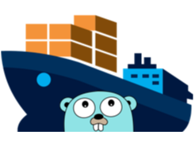
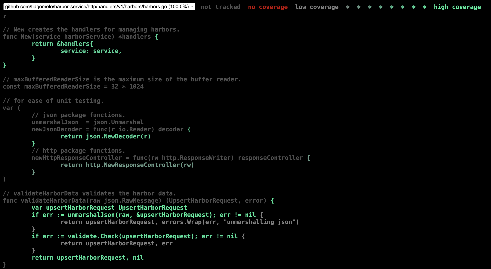
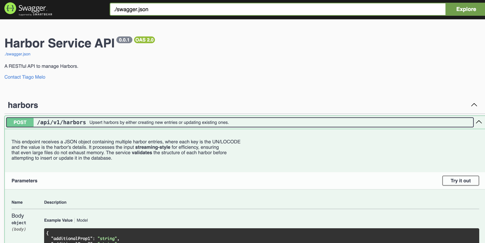

# harbor-service



A RESTful api written in [Go](https://go.dev) for upserting Harbors.

It aims to show how to handle JSON streaming in an efficient way.

## key features

- I've generated the basic REST API structure using an open source project of mine, [go-templates](https://github.com/tiagomelo/go-templates).
- Uses [SQLite](https://www.sqlite.org/) for saving Harbors in disk.
- Uses [Gorilla Mux](https://github.com/gorilla/mux) for HTTP routing.
- Implements custom middleware.
- Input validation with [validator](https://github.com/go-playground/validator).
- Database migrations handled by [golang-migrate](https://github.com/golang-migrate/migrate).
- API documentation through [go-swagger](https://github.com/go-swagger/go-swagger).
- Uses [golangci-lint](https://github.com/golangci/golangci-lint).
- Uses [govulncheck](https://pkg.go.dev/golang.org/x/vuln/cmd/govulncheck) for known vulnerabilities check.
- Ensures 100% test coverage, including both unit and integration tests.

## benchmark

Visit [benchmark](./BENCHMARK.md) for more info.

## dependencies

- [Go](https://go.dev)
- [Docker](https://www.docker.com), for linter, swagger, and if you want to run the dockerized version of the service

## endpoint

`POST api/v1/harbors`

This endpoint receives a JSON object containing multiple harbor entries, where each key is the UN/LOCODE and the value is the harbor's details. It processes the input **streaming-style** for efficiency, ensuring that even large files do not exhaust memory.

It performs 

Sample input:

```
{
    "AEAJM": {
        "name": "Ajman",
        "city": "Ajman",
        "country": "United Arab Emirates",
        "alias": [],
        "regions": [],
        "coordinates": [
            55.5136433,
            25.4052165
        ],
        "province": "Ajman",
        "timezone": "Asia/Dubai",
        "unlocs": [
            "AEAJM"
        ],
        "code": "52000"
    },
    "AEAUH": {
        "name": "Abu Dhabi",
        "coordinates": [
            54.37,
            24.47
        ],
        "city": "Abu Dhabi",
        "province": "Abu Z¸aby [Abu Dhabi]",
        "country": "United Arab Emirates",
        "alias": [],
        "regions": [],
        "timezone": "Asia/Dubai",
        "unlocs": [
            "AEAUH"
        ],
        "code": "52001"
    }
}
```

output:

```
{"message":"harbors upserted"}
```

## running it

### without Docker

```
make run PORT=<desired_port>
```

### with Docker

```
make docker-run PORT=<desired_port>
```

#### calling the endpoint via cURL

You can use the provided [ports.json](ports.json).

```
$ curl -v "http://localhost:<port>/api/v1/harbors" -H "Content-Type: application/json" --data-binary @ports.json
* Host localhost:<port> was resolved.
* IPv6: ::1
* IPv4: 127.0.0.1
*   Trying [::1]:<port>...
* Connected to localhost (::1) port <port>
> POST /api/v1/harbors HTTP/1.1
> Host: localhost:<port>
> User-Agent: curl/8.7.1
> Accept: */*
> Content-Type: application/json
> Content-Length: 501544
> 
* upload completely sent off: 501544 bytes
< HTTP/1.1 200 OK
< Date: Sat, 22 Feb 2025 00:39:55 GMT
< Transfer-Encoding: chunked
< 
* Connection #0 to host localhost left intact
{"message":"harbors upserted"}
```

The `--data-binary` flag ensures that data is sent exactly as it is, without modifications, making it ideal for streaming large JSON payloads. Unlike `--data`, which may alter line breaks or spaces, `--data-binary` preserves the original structure, preventing unwanted formatting issues. This is especially useful for APIs that process bulk data or real-time streams, ensuring the request is handled as a continuous, unmodified data stream.

## running tests

```
make test
```

## coverage report

```
make coverage
```

then, the coverage report will be opened in your browser:



## api documentation

Two files hold api's documentation: [doc.go](http/doc/doc.go) and [api.go](http/doc/api.go).

To re-generate [swagger.json](http/doc/swagger.json),

```
make swagger
```

To view it on a browser,

```
make swaggger-ui
```

then visit `localhost:8080`:



## available `Makefile` targets

```
$ make help
Usage: make [target]

  help                    shows this help message
  migrate-setup           installs golang-migrate
  create-migration        creates up and down migration files for a given name (make create-migrations NAME=<desired_name>)
  migrate-up              runs up N migrations, N is optional (make migrate-up N=<desired_migration_number>)
  migrate-down            runs down N migrations, N is optional (make migrate-down N=<desired_migration_number>)
  migrate-to-version      migrates to version V (make migrate-to-version V=<desired_version>)
  migrate-force-version   forces version V (make migrate-force-version V=<desired_version>)
  migrate-version         checks current database migrations version
  migrate-test-up         runs up N migrations on test db, N is optional (make migrate-up N=<desired_migration_number>)
  migrate-test-down       runs down N migrations on test db, N is optional (make migrate-down N=<desired_migration_number>)
  sqlite-console          opens the sqlite3 console
  swagger                 generates api's documentation
  swagger-ui              launches Swagger UI
  test                    run tests
  coverage                run tests and generate coverage report in html format
  fmt                     formats Go code
  vet                     runs Go vet to analyze code for potential issues
  govulncheck             runs Go vulnerability check
  lint                    runs linter for all packages
  build                   checks if the code compiles correctly
  tidy                    ensures go.mod and go.sum are clean
  pre-run-checks          runs Go quality checks before starting the app
  run                     runs the API
  docker-build            builds the Docker image
  docker-run              runs the Docker container
```

## references

1. Personal website: https://tiagomelo.info/
2. Linkedin: https://www.linkedin.com/in/tiagocmelo/
3. Github: https://github.com/tiagomelo